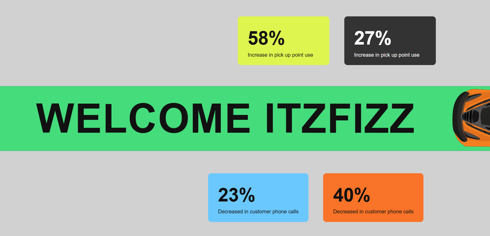

# Car Scroll Hero

A scroll-driven hero section where a car drives across the screen, leaving a green trail that reveals the headline **WELCOME ITZFIZZ**. Built for a frontend animation assignment, with a focus on smooth, scroll-linked motion and performance.

**Live demo:** https://srija597.github.io/car-scroll-hero/
**Repository:** https://github.com/srija597/car-scroll-hero
**Reference:** https://paraschaturvedi.github.io/car-scroll-animation



## Features

- **Load animation:** the headline letters stagger in smoothly (fade and slide up).
- **Scroll-linked motion:** the car, the green trail and the stat cards are driven by scroll position, not a timer. Scrolling up reverses the animation.
- **Smoothed scrubbing:** `scrub: 1` adds one second of interpolation, so motion feels fluid instead of jumpy.
- **Pinned hero:** the section stays fixed while the animation plays, then releases.
- **Staggered stat cards:** the four cards enter one after another as the car drives.
- **Accessible:** respects `prefers-reduced-motion` by showing the finished scene without animating.

## Tech stack

| Tool                            | Used for                                           |
| ------------------------------- | -------------------------------------------------- |
| Next.js (App Router)            | Project structure and static export                |
| React                           | Component-based UI                                 |
| GSAP + ScrollTrigger            | Load animation and scroll-scrubbed animation       |
| `@gsap/react`                   | `useGSAP` hook for safe setup and cleanup in React |
| CSS (`Hero.css`) + Tailwind CSS | Styling                                            |
| GitHub Actions + Pages          | Build and hosting                                  |

## How the animation works

**1. Load sequence.** A GSAP timeline animates each headline letter from `y: 60, opacity: 0` to its place with a `0.05s` stagger and a `power3.out` ease.

**2. Scroll sequence.** One ScrollTrigger timeline is tied to the scrollbar:

```js
scrollTrigger: {
  trigger: root,
  start: "top top",
  end: "+=2000",
  scrub: 1,
  pin: true,
  invalidateOnRefresh: true,
}
```

- `end: "+=2000"` sets the scroll distance used by the animation.
- `scrub: 1` ties progress to scroll position, smoothed over one second.
- `pin: true` holds the hero in place while it plays.
- `invalidateOnRefresh: true` recalculates distances when the window is resized.

Inside that timeline:

- The **car** moves from left to right with `x`.
- The **green trail** grows from the left using `scaleX`.
- The **stat card groups** drift up and down slightly for depth, and the cards fade in with a stagger.

**3. The headline reveal.** The headline is dark text on a dark road, so it is hidden at first. It becomes readable as the green trail grows underneath it, so no extra reveal code is needed.

## Performance

- Only `transform` (`x`, `y`, `scaleX`) and `opacity` are animated. No `width`, `left` or `top`, so scrolling doesn't trigger layout reflow.
- ScrollTrigger handles scroll measurement internally, so there are no manual layout reads inside scroll handlers.
- `gsap.matchMedia` keeps the reduced-motion and normal paths separate, and `media.revert()` cleans up on unmount.

## Run locally

```bash
npm install
npm run dev
```

The site uses a GitHub Pages base path, so open http://localhost:3000/car-scroll-hero

## Build and deploy

```bash
npm run build
```

The static site is exported to `out/`. Every push to `main` triggers `.github/workflows/deploy.yml`, which builds the project and publishes it to GitHub Pages.
